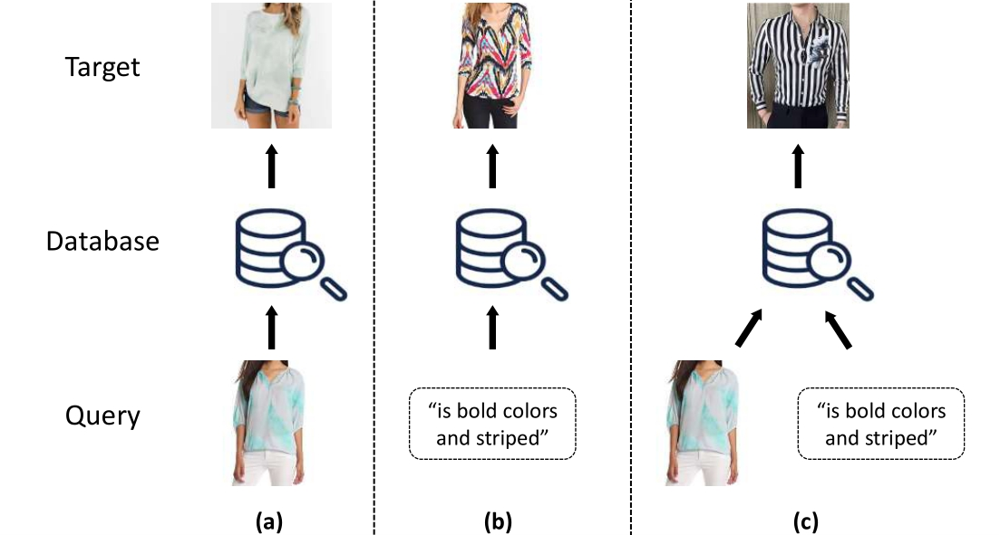
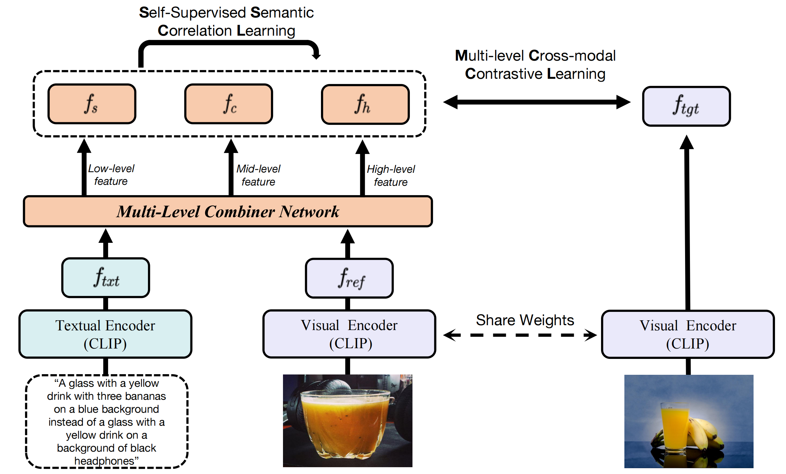
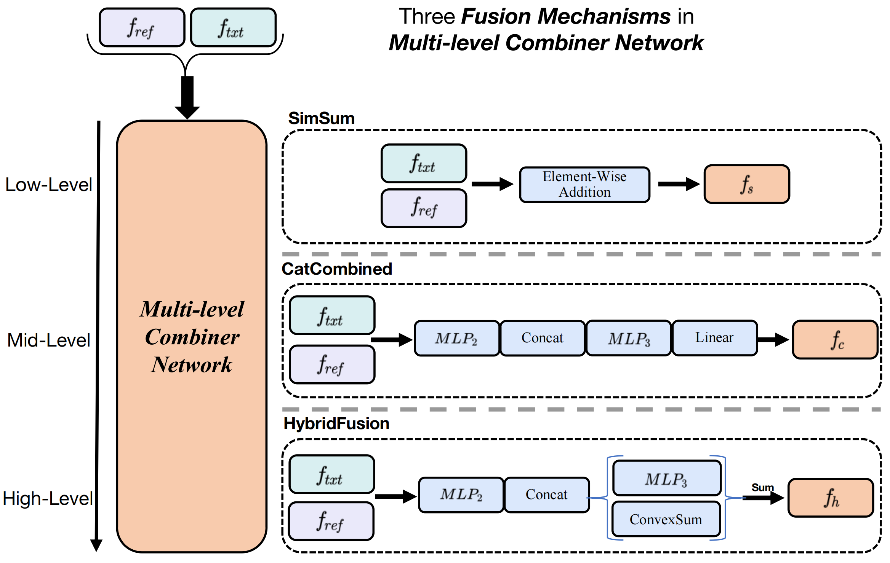

# MLCL code release

This repository contains the code release of MLCL, from our paper: **Multi-Level Contrastive Learning for Hybrid Cross-Modal Retrieval**.

## The task

Image retrieval is one of the most fundamental tasks in artificial intelligence. Most previous works focus on unimodal retrieval (i.e., image retrieval with the visual query) or cross-modal retrieval (i.e., image retrieval with the textual query). Nevertheless, considering the complexity of image retrieval in realistic scenarios (e.g., product retrieval), limiting search queries to a single modality is suboptimal.

In this work, we address the problem of **Hybrid Cross-Modal Retrieval** (HCMR), where a hybrid query comprising a reference image and a text modifier is utilized for retrieval. The text modifier provides a description of the necessary modifications to be made to the reference image in order to obtain the target image.



## Our method

We propose a multi-level contrastive learning (**MLCL**) method for image retrieval with a hybrid query using CLIP-based features. Two key components are carefully designed to overcome the drawbacks of previous methods. The first is cross-modal contrastive learning with multi-level semantic alignment (**mCCL**), which can more finely supervise the training of the whole network and extract more diverse features for retrieval. The second is self-supervised semantic correlation learning (**SSCL**), which helps to enhance the semantic correlation of the intermediate and final features of the combiner.





Our MLCL method achieves state-of-the-art performance by a consistent margin on three datasets: Shoes, FashionIQ, and CIRR.

## Preparations

### Environment

Create the environment for running our code as follow:

```shell
conda create --name mlcl python=3.8.13
conda activate mlcl
pip install -r requirements.txt
```

Note: using cuda version 11.2 (please modify `requirements.txt` otherwise)

### Datasets

The three datasets (FashionIQ, Shoes, and CIRR) are open source and can be downloaded according to the following instructions.

#### FashionIQ

Please refer to the [CosMo repo](https://github.com/postBG/CosMo.pytorch#arrows_counterclockwise-update-dec-8th-2021) for the FashionIQ dataset, including images, train-test-val splits, and train/validation candidate-captions-target triplets.

#### Shoes

The images are available on [webpage](http://tamaraberg.com/attributesDataset/index.html) and the annotations are available at [repo](https://github.com/XiaoxiaoGuo/fashion-retrieval/tree/master/dataset).

Our code assumes Shoes dataset is in a similar format as FashionIQ. Please run the following  to run our code with Shoes dataset: `python src/prepare_shoes_data.py`.

#### CIRR

Raw images are available at [CIRR repo](https://github.com/Cuberick-Orion/CIRR#raw-images) or [NLVR2 page](http://clic.nlp.cornell.edu/resources/NLVR2/) and annotations are available at [Annotations](https://github.com/Cuberick-Orion/CIRR#annotations).

For an evaluation on test split CIRR, our code produces a .json file compatible to the instructions of [Test-split Server on CIRR Dataset](https://github.com/Cuberick-Orion/CIRR/blob/main/Test-split_server.md).

### Configuration

Before running `python src/prepare_shoes_data.py` to preprocess Shoes dataset, you need to modify the values of some variables (data paths) in `prepare_shoes_data.py`:

```python
SHOES_IMAGE_DIR='Path to Shoes image dir'
SHOES_ANNOTATION_DIR='Path to Shoes annotation dir'
```

Before training, you need to modify the values of some variables (dataset paths) in `data_utils.py` to adapt them to your system and preference:

```python
base_path_cirr=Path('The path of the folder where the CIRR dataset is stored')
base_path_shoes=Path('The path of the folder where the Shoes dataset is stored')
base_path_fiq=Path('The path of the folder where the FashionIQ dataset is stored')
```

## Train

### Train image and text encoders

Finetune the CLIP encoders:

```shell
CUDA_VISIBLE_DEVICES=0 python src/clip_fine_tune.py \
--dataset 'FashionIQ or Shoes or CIRR' \
--num-epochs 100 \
--clip-model-name RN50x4 \
--encoder text or image \
--learning-rate 2e-6 \
--batch-size 128 or 64 \
--transform targetpad \
--target-ratio 1.25  \
--save-training \
--save-best \
--validation-frequency 1 \
--clip_model_ckpt 'Path to CLIP model ckpt if needed'
```

### Train Multi-Level Combiner

Train the Multi-Level Combiner network:

```shell
CUDA_VISIBLE_DEVICES=0 python src/combiner_train.py \
--dataset 'Shoes or FashionIQ or CIRR' \
--projection-dim 2560 \
--hidden-dim 5120 \
--num-epochs 1000 \
--clip-model-name RN50x4 \
--clip-model-path 'Path to finetuned CLIP model ckpt if needed' \
--combiner-lr 2e-5 \
--batch-size 2048 \
--clip-bs 64 \
--transform targetpad \
--target-ratio 1.25 \
--save-training \
--save-best \
--validation-frequency 1 \
--learn_t 1
```

## Test on CIRR dataset

Generate the prediction files to be submitted on CIRR evaluation server:

```shell
CUDA_VISIBLE_DEVICES=0 python src/cirr_test_submission.py \
--submission-name 'submit' \
--combining-function 'combiner' \
--combiner-path 'Path to Combiner model ckpt' \
--projection-dim 2560 \
--hidden-dim 5120 \
--clip-model-name RN50x4 \
--clip-model-path 'Path to CLIP model ckpt' \
--target-ratio 1.25 \
--transform targetpad \
--learn_t 1
```

